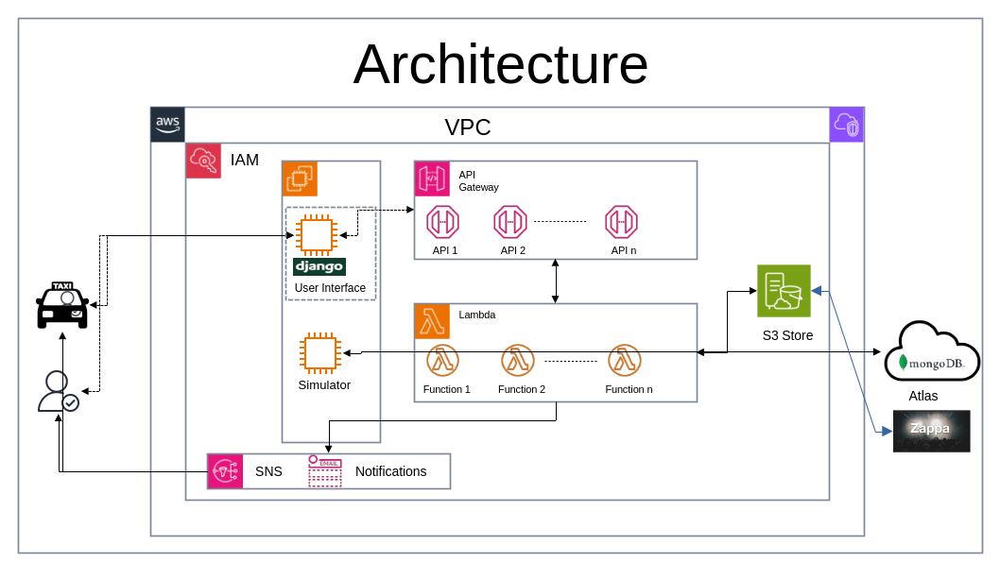

# Co OP Taxi Registration
## Authors
### Created by Suraj Pai

## Documentation

## Functionality Process Flow
1. Define the Boundary
2. Register User
3. Register Taxi
4. Find Taxi
5. Book and initiate trip

## API Endpoints
### 1. Define City Boundary
- Endpoint: /define_boundary
- Method: POST
- Description: Define the operational boundary for a city.
- Request Body
- POST /define_boundary
>{
  "city": "Bangalore",
  "boundary": [
    [
      12.834,
      77.491],
    [
      13.139,
      77.491],
    [
      13.139,
      77.861],
    [
      12.834,
      77.861]
  ]
}

- Response
>{
  "message": "Boundary defined successfully"
}
- Response 
1. 200 OK on success
2. 400 Bad Request if the request is invalid
3. 500 Internal Server Error if there is an error on the server

### 2. Register Taxi
- Register a new taxi.
- Example Request:
- Endpoint: /register_taxi
- Method: POST
- Description: Register a taxi within the city boundary.
- Request Body
- POST /register_taxi
>{
    "name": "Taxi Name",
    "email_id": "a@b.com",
    "phone_number": "12312312312312",
    "location": {
        "city": "Bangalore",
        "latitude": 12.886,
        "longitude": 77.613
    }
}
- Response
>{
  "message": "Taxi registered successfully"
} 
### 3. Register User
- Register a new user.
- POST /register_user
>{
    "name": "AAAAAAAAAAA",
    "email_id": "a@b.com",
    "phone_number": "12312312312312",
    "location": {
        "city": "Bangalore",
        "latitude": 12.886,
        "longitude": 77.613
    }
}
- Response 
1. 200 OK on success
2. 400 Bad Request if the request is invalid
3. 500 Internal Server Error if there is an error on the server

### 4. Find Taxi
- Find Taxi for a user.
- POST /find_taxi
>{
    "user_current_location": {
        "type": "Point",
        "coordinates": [
            12.957,
            77.618
        ]
    },
    "requested_taxi_type": "Luxury",
    "max_distance": 10000,
    "user_id": "66648443a06230189c6bb150",
    "max_number_of_taxi": 150,
    "destination_location": {
        "type": "Point",
        "coordinates": [
            12.886,
            77.613
        ]
    }
}
- Response
1. 200 OK on success
2. 400 Bad Request if the request is invalid
3. 500 Internal Server Error if there is an error on the server

### 5. Book and initiate trip
- Register a new user.
- POST /book_and_initiate_trip
>{
  "taxi_id": "666483a5e4dd72f83953c8d3",
  "user_id": "66648443a06230189c6bb150",
  "user_current_location": {
    "type": "Point",
    "coordinates": [
      12.957,
      77.618]
  },
  "destination_location": {
    "type": "Point",
    "coordinates": [
      13.123,
      77.812]
  }
}
- Response
1. 200 OK on success
2. 400 Bad Request if the request is invalid
3. 500 Internal Server Error if there is an error on the server

### 6. Architecture
In the architecture diagram below, the django based user interface is not complete and is a standalone application connecting to a mongodb atlas database and is able to create users and taxis and login into the interface with the created logins

And, the taxi movement simulator is within the file taxi_driver_management.py starting at about line number 419

# End
